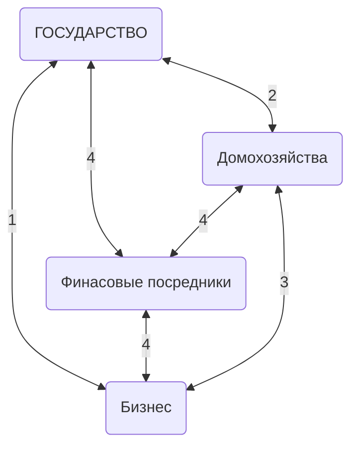

# Финансовые отношения
**Финансовые отношения** - отношения, которые возникают между экономическими субъектами при формировании и использования фондов денежных средств.

Не являются финансовыми отношениями контрактные отношения (например, выполнение заказа по договору, даже от государства) и трудовые отношения.

**Участники финансовых отношений:**

1. Налоги и отчисления в бюджет и внебюджетные фонды. Получение средств из бюджета.
2. Получение социальных выплат. Платежи в бюджет.
3. Инвестирование в предприятие и получение дивидендов и процентных платежей
4. Обслуживание финансовых потоков

**Основные налоговые доходы государственного бюджета:**
1. Налоги за природные ресурсы
2. НДС на производимые товары
3. НДС на ввозимые товары
4. Налоги на прибыль и доходы
НДС идёт в региональные бюджеты (субъект РФ) - 85% и в местные бюджеты (города и т.п.) - 15%.
# Источники финансирования
- Внутренние
	- Амортизация
	- Капитализируемая прибыль (нераспределенная прибыль) - чистая прибыль после выплаты дивидендов. В т.ч. резервы - нераспределенная прибыль предыдущих лет.
- Внешние:
	- Заёмные средства
		- Кредиты
		- Облигационные займы
	- Привлеченные средства
		- Обыкновенные акции
		- Привилегированные акции
По статистике, как в России, так и за рубежом приоритеты источников финансирования распределяются следующим образом (по убыванию):
1. Внутренние
2. Заёмные средства
3. Привлеченные средства
# Структура финансового рынка
На финансовом рынке происходит мобилизация капитала, необходимого компаниям для реализации инвестиционных проектов и ведения хозяйственной деятельности, а экономические субъекты, имеющие свободные денежные средства, используя механизм финансового рынка, осуществляют инвестиции в ценные бумаги и другие финансовые инструменты.
Простыми словами на финансовом рынке продают и покупают деньги.
## Классификация финансовых рынков
1. Про срокам обращения финансовых средств
	- Денежный рынок - движение краткосрочных ссуд (до 1 года). Основное назначение - обеспечить предприятия оборотными средствами.
	- Рынок капитала - движение долгосрочных накоплений (более 1 года). Назначение - обслуживание потребностей предприятий в обновлении и модернизации основного капитала.
2. По сферам функционирования
3. По стадиям выпуска и обращения
	- Первичны рынок - инвестор приобретает ценные бумаги напрямую у эмитента
	- Вторичный рынок - инвестор приобретает ценные бумаги у других инвесторов
4. По организации торговли финансовыми инструментами

Финансовый рынок представлен как кредитными инструментами, так и фондовым рынком (рынком ценных бумаг), т.е. рынком, на котором движение средств обслуживается ценными бумагами.
# Эмиссия ценных бумаг
Решение об эмиссии облигаций принимает Совет Директоров
## Принятие решения об эмиссии акций

| Способы размещения                                              | Общее собрание акционеров                                                                                                                                                                                               |
| --------------------------------------------------------------- | ----------------------------------------------------------------------------------------------------------------------------------------------------------------------------------------------------------------------- |
| Закрытое размещение акций                                       | Квалифицированное большинство голосов (3/4)                                                                                                                                                                             |
| Закрытое размещение привилегированных акций с особыми условиями | Единогласно                                                                                                                                                                                                             |
| Отрытое размещение, объем эмиссии < 25% размещенных акций       | Простое большинство голосов (50% + 1 акция)  Можно, указав в уставе, это делегировать совету директоров - тогда нужно единогласное решение. Если оно не достигается - то вопрос выносится на собрание акционеров. |
| Отрытое размещение, объем эмиссии >25% размещенных акций        | Квалифицированное большинство голосов (3/4)                                                                                                                                                                             |
## Проспект эмиссии ценных бумаг
**Проспект эмиссии ценных бумаг** - официальный документ, который готовится компанией-эмитентом, и содержит существенную информацию об эмитенте и его ценных бумагах.

**Основные составляющие проспекта эмиссии**
* Описание компании и ее бизнеса
* Структура органов управления
* Финансовые показатели деятельности компании
* Описание выпускаемой ценной бумаги
* Направления использования денежных средств
* Факторы риска
Стандарты разработки проспекта эмиссии

**Виды акционерных обществ:**
- Публичное АО (бывшее ОАО):
	- Может делать как открытое (публичное) размещение, так и закрытое (частное) размещение
	- Нужен проспект эмиссии ценных бумаг
- Непубличное АО (бывшее ЗАО):
	- Только закрытое (частное) размещение
	- Максимальное число акционеров - 50
	- Нужны условия выпуска

**Когда не требуется подготовка проспекта эмиссии:**
По составу будущих инвесторов:
- Ценные бумаги предлагаются только квалифицированным инвесторам и лицам, имеющим преимущественные права
- Акции предлагаются только акционерам АО
- Определенный круг лиц, число которых не превышает 150 (без учёта квалифицированных инвесторов и лиц, имеющих привилегированные права)
По объему привлекаемых средств:
- Сумма привлекаемых денежных средств в течении 1 года не превышает 1 млрд руб. (для банков - 4 млрд руб.)
- Сумма денежных средств, вносимая в оплату ценных бумаг каждым приобретателем не менее 1,5 млн руб.
- Облигации размещаются в рамках программы облигаций и с даты регистрации проспекта облигаций, зарегистрированного одновременно с регистрацией программы не истёк 1 год
## Организация процесса выпуска ценных бумаг
**Функции организатора выпуска облигационного займа:**
- Оценка финансового состояния и кредитоспособности эмитента
- Конструирование эмиссии облигаций (определение параметров облигационного займа)
- Определение круга потенциальных инвесторов
- Консультирование эмитента по юридическим и финансовым вопросам, связанным с эмиссией облигаций
- Подготовка проспекта эмиссии
- Сопровождение процедуры регистрации проспекта эмиссии
- Обеспечение раскрытия информации на всех этапах проведения эмиссии
- Подготовка инвестиционного меморандума
- Формирование синдиката андеррайтеров (при необходимости)
- Проведение роуд-шоу (совместно с андреррайтерами)
- Взаимодействие с биржей и депозитариями
- Оказание помощи эмитенту в выборе платежного агента

**Андеррайтинг** - руководство процессом выпуска и распределения ценных бумаг
**Андеррайтер** - гарант выплаты денег эмитенту
В подавляющем большинстве случаев организатор выпуска является андеррайтером

Классика - андеррайтер выкупает всю эмиссию с дисконтом (например за 98%) и после сам продаёт её инвесторам, по той цене, по которой сможет.
В России - задача андеррайтера (корректное название - агент по размещению) донести информацию об эмиссии до инвестором, провести встречи с инвесторами (роуд-шоу), а далее эмитент напрямую продаёт ценные бумаги инвесторам.
Типы андеррайтинга:
- Гарантия размещения 100% - всё неразмещённое андеррайтер выкупает сам по последней цене
- Гарантия размещения ХХ% - всё неразмещённое до ХХ% андеррайтер выкупает сам по последней цене
- Максимальные усилия - андеррайтер не гарантирует ничего.

**Процедура выпуска ценных бумаг:**
1. Подготовка проспекта (20-30 дней)
2. Регистрация проспекта (30-60 дней)
3. Раскрытие информации (15-20 дней)
4. Размещение (1-30 дней)
5. Регистрация отчёта (15 дней)
6. Раскрытие информации (15-20 дней)
7. Торговля на вторичном рынке

## Биржевые облигации
Эмиссия **биржевых облигаций** осуществляется без государственной регистрации их выпуска, проспект облигаций и отчёта об итогах выпуска облигаций.

При одновременном соблюдении следующих условий:
- облигации допускаются к организованным торгам, проводимым биржей, и размещаются путём открытой подписки;
- облигации не предоставляют их владельцам иных прав, кроме права на получение номинальной стоимости или номинальной стоимости и процента от неё;
- централизованный учёт прав на облигации осуществляется центральным депозитарием;
- выплата номинальной стоимости и процента по облигациям осуществляется только денежными средствами.